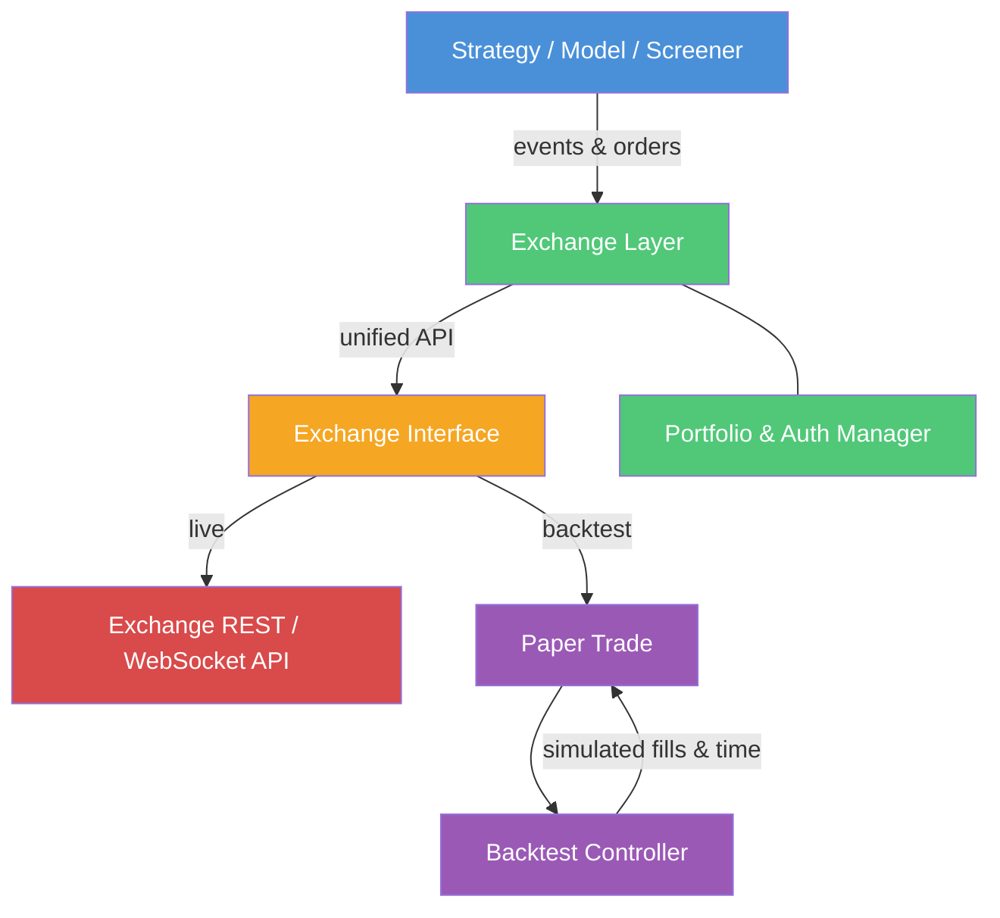

# Blankly

**Trading automation framework for building, backtesting, and deploying quantitative strategies across multiple exchanges.**

| Field | Details |
|-------|---------|
| Language | Python |
| License | LGPL-3.0 |
| Version | v1.18.11-beta |
| Author | Emerson Dove / Blankly Finance |
| Package | `pip install blankly` |
| Docs | [docs.blankly.finance](https://docs.blankly.finance) |
| GitHub | [Blankly-Finance/Blankly](https://github.com/Blankly-Finance/Blankly) |

## Overview

Blankly is a Python framework for rapidly building, backtesting, and deploying quantitative trading strategies across multiple exchanges. Its core philosophy is **write once, run anywhere** -- the same strategy code runs in backtesting and live trading by changing a single line. Blankly abstracts exchange-specific differences behind a unified interface, supporting crypto (Binance, Coinbase Pro, KuCoin, OKX), stocks (Alpaca), and forex (OANDA).

## Key Features

### Trading Capabilities
- Event-driven strategy framework with price, bar, tick, orderbook, scheduled, and arbitrage events
- Spot and futures trading with unified API
- Paper trading with simulated order execution
- Screener framework for batch symbol processing
- Multi-core execution via BlanklyBot

### Architecture
- Three-layer exchange abstraction (Exchange -> Interface -> API)
- Exchange-agnostic strategy design pattern
- Automatic live/backtest switching via PaperTrade wrapper
- WebSocket managers for real-time data streaming
- Model base class with lifecycle management

### Supported Venues
- **Crypto**: Binance (spot + futures), Coinbase Pro, KuCoin, OKX, FTX (deprecated)
- **Stocks**: Alpaca
- **Forex**: OANDA
- **Simulation**: Paper Trade, Keyless Exchange (no API keys needed)

### Data Management
- Historical data loading and caching
- Real-time WebSocket feeds (ticker, orderbook)
- Built-in technical indicators (SMA, EMA, RSI, MACD, Stochastic, ADX)
- CSV data reader for backtesting

### Risk Management
- Order validation against exchange filters (min/max size, price increments)
- Portfolio metrics (Sharpe, Sortino, CAGR, max drawdown)
- Fee-accurate backtesting using actual user fee tiers
- Position sizing utilities

## Architecture Summary

```
User Code (Strategy / Model / Screener)
         |
Exchange Layer (Exchange / FuturesExchange)
  - Portfolio management, authentication
         |
Interface Layer (ExchangeInterface / FuturesExchangeInterface)
  - Homogenized trading operations, order management
         |
API Layer (Exchange-specific REST / WebSocket)
  - Raw exchange communication
```



## Component Table

| Component | Location | Purpose |
|-----------|----------|---------|
| Exchange | `src/blankly/exchanges/exchange.py` | Base exchange class for spot trading |
| FuturesExchange | `src/blankly/exchanges/futures/futures_exchange.py` | Futures exchange wrapper |
| ExchangeInterface | `src/blankly/exchanges/interfaces/exchange_interface.py` | Homogenized trading interface |
| Strategy | `src/blankly/frameworks/strategy/strategy.py` | Event-driven strategy framework |
| Model | `src/blankly/frameworks/model/model.py` | Abstract base for backtestable systems |
| Screener | `src/blankly/frameworks/screener/screener.py` | Batch symbol screening |
| PaperTrade | `src/blankly/exchanges/interfaces/paper_trade/paper_trade.py` | Backtesting engine |
| BackTestController | `src/blankly/exchanges/interfaces/paper_trade/backtest_controller.py` | Time simulation and event queue |
| TickerManager | `src/blankly/exchanges/managers/ticker_manager.py` | Price tick WebSocket management |
| OrderbookManager | `src/blankly/exchanges/managers/orderbook_manager.py` | Orderbook WebSocket management |
| Indicators | `src/blankly/indicators/` | Technical indicators (SMA, RSI, MACD, etc.) |
| Metrics | `src/blankly/metrics/portfolio.py` | Portfolio performance metrics |

## Quick Start

This example runs a complete RSI backtest using the `KeylessExchange`, which requires no API keys. It uses a CSV file with OHLCV data.

```python
import blankly
from blankly.data import PriceReader
import pandas as pd
import os

# 1. Create inline OHLCV CSV data (BTC-USD daily prices)
csv_data = """time,low,high,open,close,volume
1588377600,8600,8900,8700,8850,1200
1588464000,8800,9100,8850,9050,1300
1588550400,9000,9300,9050,9200,1100
1588636800,9100,9500,9200,9400,1400
1588723200,9300,9600,9400,9500,1000
1588809600,9200,9550,9500,9300,1150
1588896000,9100,9400,9300,9350,1050
1588982400,9300,9700,9350,9650,1250
1589068800,9600,9900,9650,9800,1350
1589155200,9700,10100,9800,10000,1500
"""
csv_path = "/tmp/blankly_demo.csv"
with open(csv_path, "w") as f:
    f.write(csv_data)

# 2. Define strategy callbacks
def init(symbol, state: blankly.StrategyState):
    state.variables['history'] = state.interface.history(
        symbol, to=5, return_as='deque', resolution=state.resolution
    )['close']

def price_event(price, symbol, state: blankly.StrategyState):
    state.variables['history'].append(price)
    if len(state.variables['history']) > 3:
        prices = list(state.variables['history'])
        # Simple momentum: buy if price rising, sell if falling
        if prices[-1] > prices[-2] > prices[-3]:
            cash = state.interface.cash
            if cash > 0:
                state.interface.market_order(symbol, side='buy', size=cash / price)
        elif prices[-1] < prices[-2]:
            position = state.interface.account[state.base_asset].available
            if position > 0:
                state.interface.market_order(symbol, side='sell', size=position)

# 3. Run backtest with KeylessExchange (no API keys needed)
exchange = blankly.KeylessExchange(price_reader=PriceReader(csv_path, 'BTC-USD'))
strategy = blankly.Strategy(exchange)
strategy.add_price_event(price_event, symbol='BTC-USD', resolution='1d', init=init)
results = strategy.backtest(start_date=1588377600, end_date=1589155200,
                            initial_values={'USD': 10000})
print(results)
```

## Links

- [Architecture](architecture.md) -- System design and component diagrams
- [Workflow](workflow.md) -- Event flows and key workflows
- [State Management](state-management.md) -- State machines and lifecycle
- [Development](development.md) -- Setup, standards, and strategy development
