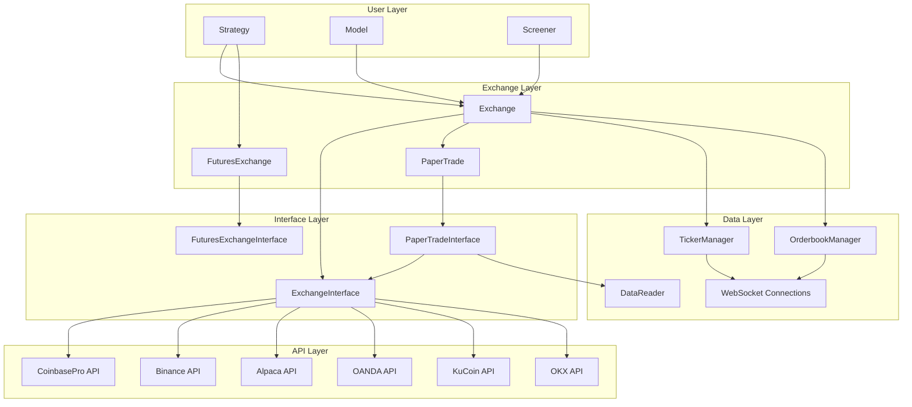
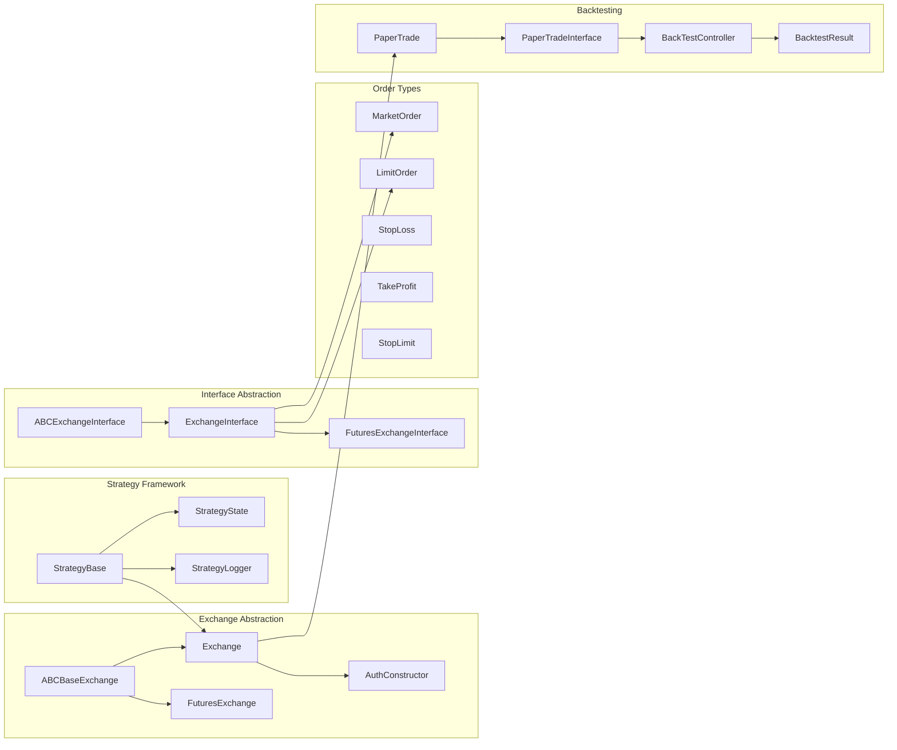

# Blankly -- Architecture

## System Design

Blankly uses a three-layer abstraction that separates user strategy logic from exchange-specific communication. This allows the same strategy code to run against any supported exchange, and to seamlessly switch between live trading and backtesting.

## Trading Paradigm & Key Features

| Feature | Support | Details |
|---------|---------|---------|
| Backtesting Approach | Event-driven | PaperTrade wrapper intercepts exchange calls; BackTestController simulates time and order execution |
| Live Trading | Yes | Same strategy code runs live via Exchange classes with REST/WebSocket APIs |
| Paper Trading | Yes | PaperTradeInterface wraps real ExchangeInterface for simulated execution |
| Multi-Asset | Yes | Crypto (Binance, Coinbase Pro, KuCoin, OKX), stocks (Alpaca), forex (OANDA), futures (Binance Futures) |
| Data Feeds | Exchange APIs + WebSocket | Real-time ticker/orderbook via WebSocket; historical OHLCV via REST; CSV via DataReader |
| ML Integration | No | No built-in ML; examples include an MLP model but no framework integration |
| Risk Management | Custom | Order validation against exchange filters (min/max size, price increments); portfolio metrics (Sharpe, Sortino, CAGR, max drawdown) |
| Optimization | No | No built-in hyperparameter or strategy optimization |
| Execution | Both | Live execution via exchange APIs; simulated execution via PaperTrade/BackTestController |

## High-Level Architecture

## Component Architecture

## Key Design Patterns

### Abstract Factory
`Exchange.construct_interface_and_cache()` creates exchange-specific interfaces. Each exchange subclass (Binance, Alpaca, etc.) implements this to construct the appropriate interface and websocket connections.

### Decorator Pattern
`PaperTradeInterface` wraps a real `ExchangeInterface` for simulation. During backtesting, the Model automatically replaces the real exchange with a PaperTrade wrapper, intercepting all order calls and simulating execution.

### Strategy Pattern
Different event types (price_event, bar_event, tick_event, orderbook_event) share the same callback signature via `StrategyState`. The Strategy class manages scheduling and dispatching events to user callbacks.

### Observer Pattern
WebSocket managers (`TickerManager`, `OrderbookManager`) support multiple callback subscribers per feed. A single WebSocket connection can drive multiple strategy callbacks.

### Template Method
`Model.main()` is an abstract method called by both `run()` (live) and `backtest()` (simulation). The framework handles exchange setup and time management transparently.

## Exchange Interface Contract

All exchange interfaces implement these core operations:

| Operation | Method | Description |
|-----------|--------|-------------|
| Market Order | `market_order(symbol, side, size)` | Immediate execution |
| Limit Order | `limit_order(symbol, side, price, size)` | Price-limited execution |
| Cancel | `cancel_order(symbol, order_id)` | Cancel pending order |
| Account | `get_account()` | Account balances |
| Products | `get_products()` | Available trading pairs |
| History | `get_product_history(symbol, period, resolution)` | Historical OHLCV data |
| Price | `get_price(symbol)` | Current price |
| Orders | `get_open_orders(symbol)` | Pending orders |

## Backtesting Engine

The backtesting engine consists of three key components:

1. **PaperTrade** -- Wraps a real Exchange, intercepting all calls
2. **PaperTradeInterface** -- Simulates order execution against historical data
3. **BackTestController** -- Manages time simulation, event queue, and result generation

The controller maintains a sorted event queue and advances simulated time through historical data, evaluating orders at each tick against bid/ask prices.

---
## See Also
- [README](README.md) — Project overview and quick start
- [Workflow](workflow.md) — Event flows and processing pipelines
- [State Management](state-management.md) — State lifecycle and data models
- [Development](development.md) — Development guide and best practices
