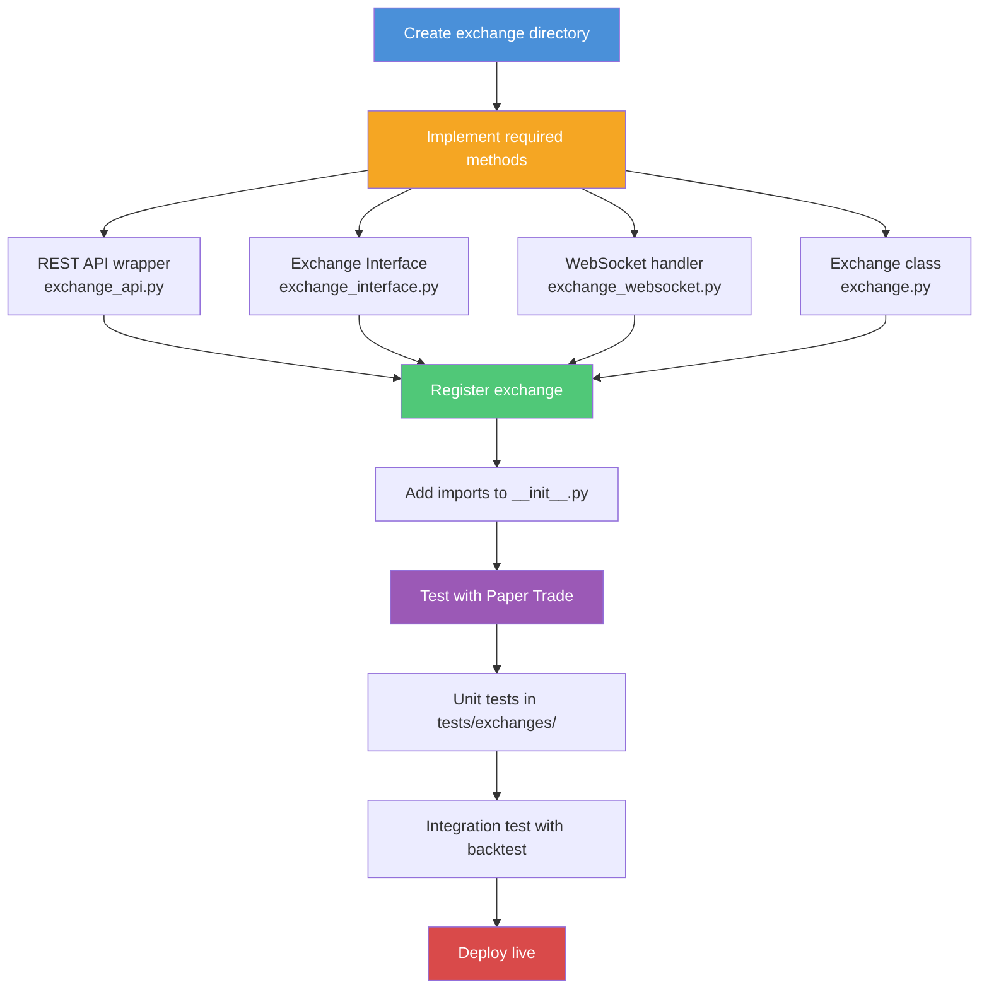

# Blankly -- Development Guide

## Setup

### From PyPI

```bash
pip install blankly
blankly init
```

### From Source

```bash
git clone https://github.com/Blankly-Finance/Blankly.git
cd blankly
pip install -e .
pip install pytest pytest-mock
```

### Configuration Files

After `blankly init`, four configuration files are created:

| File | Purpose |
|------|---------|
| `keys.json` | Exchange API credentials |
| `settings.json` | Exchange-specific preferences (fees, websockets) |
| `backtest.json` | Backtesting parameters |
| `blankly.json` | Deployment settings |

## Testing

```bash
# Run all tests
pytest

# Run specific test file
pytest tests/test_auth_constructor.py

# Run specific test
pytest tests/test_auth_constructor.py::TestAuthConstructor::test_method -v

# Generate coverage
pytest --cov=blankly tests/
```

## Code Standards

- **Formatter**: yapf (PEP 8 style)
- **Python versions**: 3.7, 3.8, 3.9, 3.10
- **Test framework**: pytest with unittest.TestCase classes
- **Naming**: snake_case for functions/variables, PascalCase for classes

## Building a Strategy

### Minimal Price Event Strategy

```python
import blankly

def init(symbol, state: blankly.StrategyState):
    state.variables['history'] = state.interface.history(symbol, to=150)['close']

def price_event(price, symbol, state: blankly.StrategyState):
    rsi = blankly.indicators.rsi(state.variables['history'])
    if rsi[-1] < 30:
        state.interface.market_order(symbol, side='buy', size=1)
    elif rsi[-1] > 70:
        state.interface.market_order(symbol, side='sell', size=1)
    state.variables['history'].append(price)

exchange = blankly.CoinbasePro()
strategy = blankly.Strategy(exchange)
strategy.add_price_event(price_event, symbol='BTC-USD', resolution='1d', init=init)

# Backtest
results = strategy.backtest(to='1y', initial_values={'USD': 10000})
# Or live: strategy.start()
```

### Futures Strategy

```python
import blankly

exchange = blankly.BinanceFutures()
strategy = blankly.FuturesStrategy(exchange)

def futures_price_event(price, symbol, state: blankly.FuturesStrategyState):
    state.interface.set_leverage(10, symbol)
    state.interface.market_order(symbol, side='buy', size=0.01)

strategy.add_price_event(futures_price_event, symbol='BTC-USDT', resolution='1h')
strategy.backtest(to='6m', initial_values={'USDT': 10000})
```

### Screener

```python
import blankly

def init(state):
    state.variables['threshold'] = 70

def evaluator(symbol, state):
    prices = state.interface.history(symbol, to=20)['close']
    rsi = blankly.indicators.rsi(prices)
    return {'rsi': rsi[-1], 'signal': 'overbought' if rsi[-1] > state.variables['threshold'] else 'neutral'}

def formatter(results, state):
    print(results)

exchange = blankly.CoinbasePro()
screener = blankly.Screener(exchange, evaluator, symbols=['BTC-USD', 'ETH-USD'],
                            init=init, formatter=formatter)
```

## Adding a New Exchange



1. Create `src/blankly/exchanges/interfaces/{exchange_name}/`
2. Implement:
   - `{exchange}_api.py` -- Raw REST API wrapper
   - `{exchange}_interface.py` -- Extend `ExchangeInterface`, implement abstract methods
   - `{exchange}_websocket.py` -- Extend `ABCExchangeWebsocket`
   - `{exchange}.py` -- Extend `Exchange`, implement `construct_interface_and_cache()`
3. Add imports to `src/blankly/__init__.py`
4. Create tests in `tests/exchanges/interfaces/{exchange_name}/`

### Interface Methods to Implement

| Method | Description |
|--------|-------------|
| `market_order()` | Submit market order |
| `limit_order()` | Submit limit order |
| `cancel_order()` | Cancel pending order |
| `get_account()` | Get account balances |
| `get_products()` | List available trading pairs |
| `get_order()` | Get order status |
| `get_open_orders()` | List pending orders |
| `get_price()` | Get current price |
| `get_product_history()` | Get historical OHLCV data |

## Built-in Indicators

```python
import blankly

blankly.indicators.sma(prices, period=20)    # Simple Moving Average
blankly.indicators.ema(prices, period=12)    # Exponential Moving Average
blankly.indicators.rsi(prices, period=14)    # Relative Strength Index
blankly.indicators.macd(prices)              # MACD
blankly.indicators.stochastic(high, low, close)  # Stochastic Oscillator
blankly.indicators.adx(high, low, close)     # Average Directional Index
```

## CLI Usage

```bash
blankly init      # Initialize new project
blankly login     # Login to platform
blankly deploy    # Deploy model
blankly keys add  # Add API keys interactively
```

## Important Notes

- Always use `state.time` instead of `time.time()` in strategies
- Always use `model.sleep()` instead of `time.sleep()` in Model subclasses
- Use `blankly.trunc(value, decimals)` for exchange precision rounding
- Resolution strings: `'1m'`, `'5m'`, `'15m'`, `'1h'`, `'1d'`

## Configuration Reference

### keys.json

| Parameter | Type | Default | Description |
|-----------|------|---------|-------------|
| `API_KEY` | str | -- | Exchange API key (per exchange block) |
| `API_SECRET` | str | -- | Exchange API secret (per exchange block) |
| `API_PASS` | str | -- | Exchange API passphrase (Coinbase Pro only) |
| `sandbox` | bool | `false` | Use exchange sandbox/testnet endpoint |

### settings.json

| Parameter | Type | Default | Description |
|-----------|------|---------|-------------|
| `settings.use_sandbox` | bool | `false` | Route orders to sandbox environment |
| `settings.websocket_buffer_size` | int | `2` | WebSocket message buffer size |
| `settings.test_connectivity_on_auth` | bool | `true` | Verify exchange connection on startup |
| `settings.coinbase_pro.cash` | str | `"USD"` | Quote currency for Coinbase Pro |
| `settings.binance.cash` | str | `"USDT"` | Quote currency for Binance |
| `settings.binance.binance_tld` | str | `"com"` | Binance TLD (`"com"` or `"us"`) |
| `settings.alpaca.cash` | str | `"USD"` | Quote currency for Alpaca |
| `settings.oanda.cash` | str | `"USD"` | Quote currency for OANDA |

### backtest.json

| Parameter | Type | Default | Description |
|-----------|------|---------|-------------|
| `price_data.assets` | list | `[]` | Symbols to cache price data for |
| `price_data.exchange` | str | -- | Exchange to source backtest data from |
| `price_data.start` | str | -- | Backtest data start date (ISO format) |
| `price_data.end` | str | -- | Backtest data end date (ISO format) |
| `price_data.resolution` | str | -- | Bar resolution (`"1m"`, `"1h"`, `"1d"`) |
| `backtest_settings.initial_values` | dict | -- | Starting balances (e.g., `{"USD": 10000}`) |
| `backtest_settings.GUI_output` | bool | `true` | Show interactive backtest results chart |
| `backtest_settings.show_tickers_with_zero` | bool | `false` | Include zero-balance assets in output |
| `backtest_settings.save_initial_account_value` | bool | `true` | Record initial portfolio value |

### Strategy.backtest() Parameters

| Parameter | Type | Default | Description |
|-----------|------|---------|-------------|
| `to` | str/int | -- | Backtest duration (`'1y'`, `'6m'`) or end timestamp |
| `start_date` | int/str | None | Start timestamp (epoch seconds) or ISO date |
| `end_date` | int/str | None | End timestamp (epoch seconds) or ISO date |
| `initial_values` | dict | None | Starting balances, e.g. `{'USD': 10000}` |
| `GUI_output` | bool | `True` | Show interactive performance chart |
| `save` | bool | `False` | Save backtest results to file |

## Troubleshooting

### `ModuleNotFoundError: No module named 'newnewtulipy'`
This C extension requires build tools. On Linux: `sudo apt install build-essential`. On macOS: `xcode-select --install`. On Windows: install Visual Studio Build Tools.

### `KeyError` when accessing `state.interface.account[asset]`
The asset key must match the exchange's symbol format. For Coinbase Pro use `'BTC'` (not `'BTC-USD'`). Check `state.base_asset` and `state.quote_asset` for the correct identifiers.

### Backtest returns empty or flat results
Ensure `initial_values` matches the quote currency. For crypto, use `{'USD': 10000}` or `{'USDT': 10000}` depending on the exchange. Also verify the `resolution` parameter matches available data granularity.

### `AttributeError: 'NoneType' object has no attribute 'get_price'`
The exchange interface was not properly initialized. When using `KeylessExchange`, ensure you pass a `PriceReader` with data covering the full backtest period. For live exchanges, verify `keys.json` has valid credentials.

### WebSocket disconnections during live trading
Blankly auto-reconnects WebSocket feeds, but network interruptions can cause missed ticks. Implement defensive checks in `price_event` callbacks: verify `price > 0` and handle `None` values in `state.variables`.

### `decimal.InvalidOperation` or precision errors
Exchanges enforce specific lot sizes and tick increments. Use `blankly.trunc(value, decimals)` to round order sizes. Check `state.interface.get_products()` for each symbol's precision rules.

### `time.time()` returns wrong value in backtests
Never use `time.time()` in strategy code. Use `state.time` inside strategy callbacks, or `model.time` inside Model subclasses. In backtesting, `time.time()` returns wall-clock time, not simulated time.

### Paper trade results differ from live execution
Paper trading uses mid-price fills, while live exchanges fill at bid/ask. Fees in paper trading use your actual fee tier from the exchange. Slippage and partial fills are not simulated.

## Security Considerations

- **API key storage**: Store exchange credentials in `keys.json`, which should be added to `.gitignore`. Never commit API keys to version control. Use environment variables or a secrets manager for production deployments.
- **Key permissions**: Configure exchange API keys with the minimum required permissions. For backtesting-only workflows, use read-only keys. For live trading, enable trading but disable withdrawal permissions.
- **Sandbox testing**: Always set `"use_sandbox": true` in `settings.json` during development. This routes orders to the exchange's testnet, preventing accidental real-money trades.
- **KeylessExchange for safe testing**: Use `blankly.KeylessExchange` with `PriceReader` for backtesting without any exchange credentials. This eliminates the risk of accidental live orders.
- **WebSocket security**: All exchange WebSocket connections use TLS (wss://). The framework does not support unencrypted WebSocket connections.
- **Deployment tokens**: The `blankly login` / `blankly deploy` commands authenticate with the Blankly platform. Treat deployment tokens as secrets and rotate them periodically.
- **Rate limiting**: Exchange API calls are not rate-limited by default. Excessive calls can trigger IP bans. Use appropriate `resolution` intervals (avoid sub-second for REST-based price events).

---
## See Also
- [README](README.md) — Project overview and quick start
- [Architecture](architecture.md) — System design and components
- [Workflow](workflow.md) — Event flows and processing pipelines
- [State Management](state-management.md) — State lifecycle and data models
