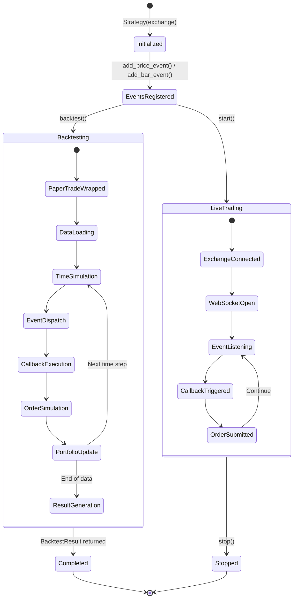
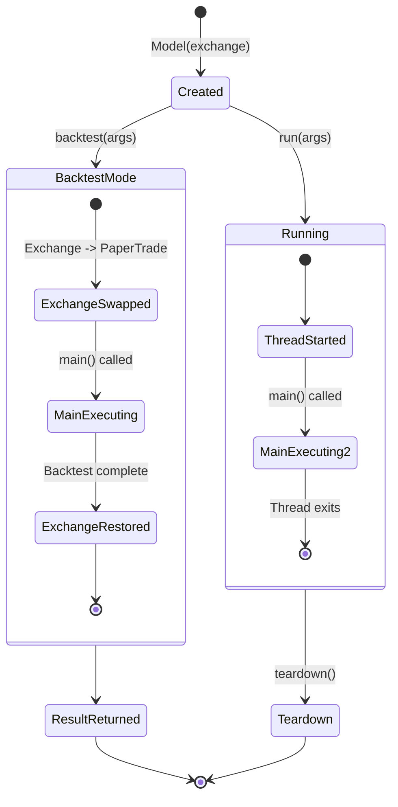
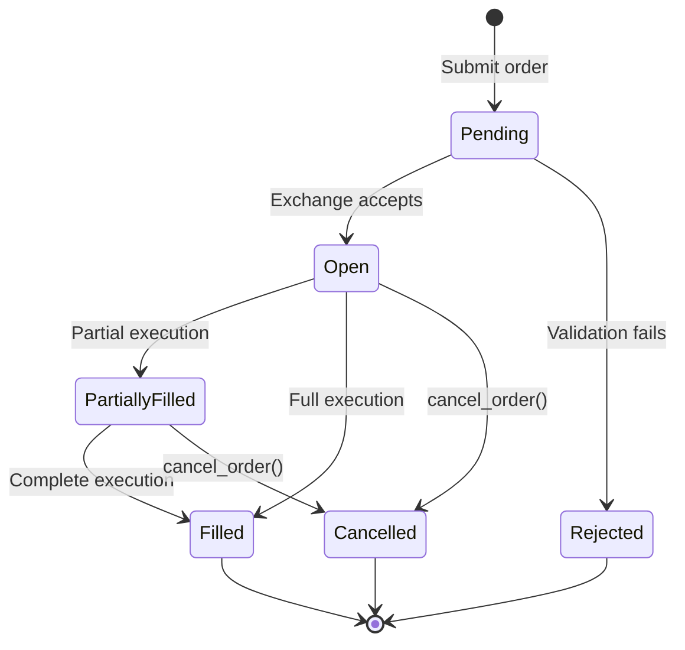
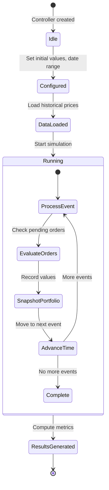
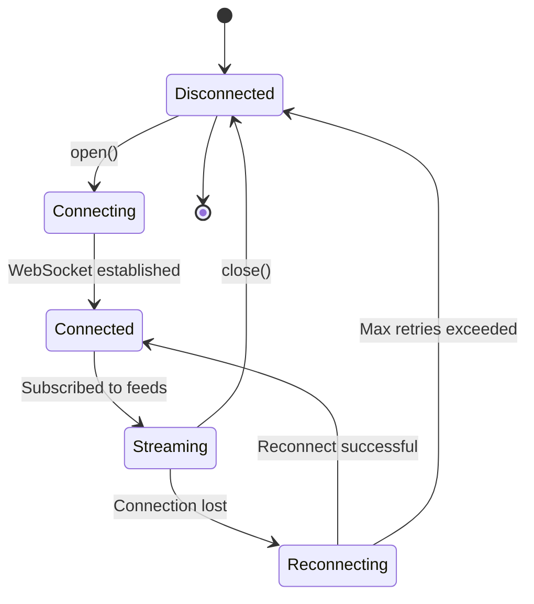

# Blankly -- State Management

## Strategy State Machine

## StrategyState Lifecycle

The `StrategyState` object is passed to every strategy callback, providing access to:

| Property | Type | Description |
|----------|------|-------------|
| `variables` | `dict` | Persistent state between callbacks |
| `interface` | `ABCExchangeInterface` | Trading operations |
| `symbol` | `str` | Current symbol |
| `base_asset` | `str` | Base currency (e.g., BTC) |
| `quote_asset` | `str` | Quote currency (e.g., USD) |
| `time` | `float` | Current time (works in both live and backtest) |
| `resolution` | `int` | Event resolution in seconds |

## Model Lifecycle

## Order State Machine

## BackTestController State

The BackTestController manages simulated time and portfolio state:

## Time Management

Blankly handles time differently in live vs backtest mode:

| Operation | Live Mode | Backtest Mode |
|-----------|-----------|---------------|
| Current time | `time.time()` | `BackTestController.time` |
| Sleep | `time.sleep(n)` | Advance simulated time by n |
| State access | `state.time` | `state.time` (unified) |

Users should always use `state.time` and `model.sleep()` to ensure code works in both modes.

## WebSocket Connection State

---
## See Also
- [README](README.md) — Project overview and quick start
- [Architecture](architecture.md) — System design and components
- [Workflow](workflow.md) — Event flows and processing pipelines
- [Development](development.md) — Development guide and best practices
