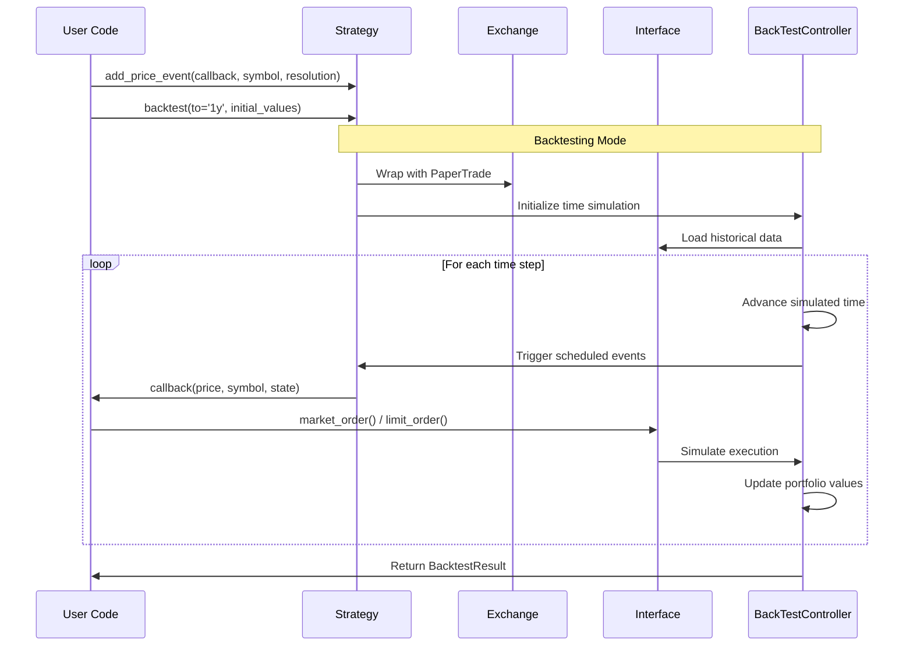
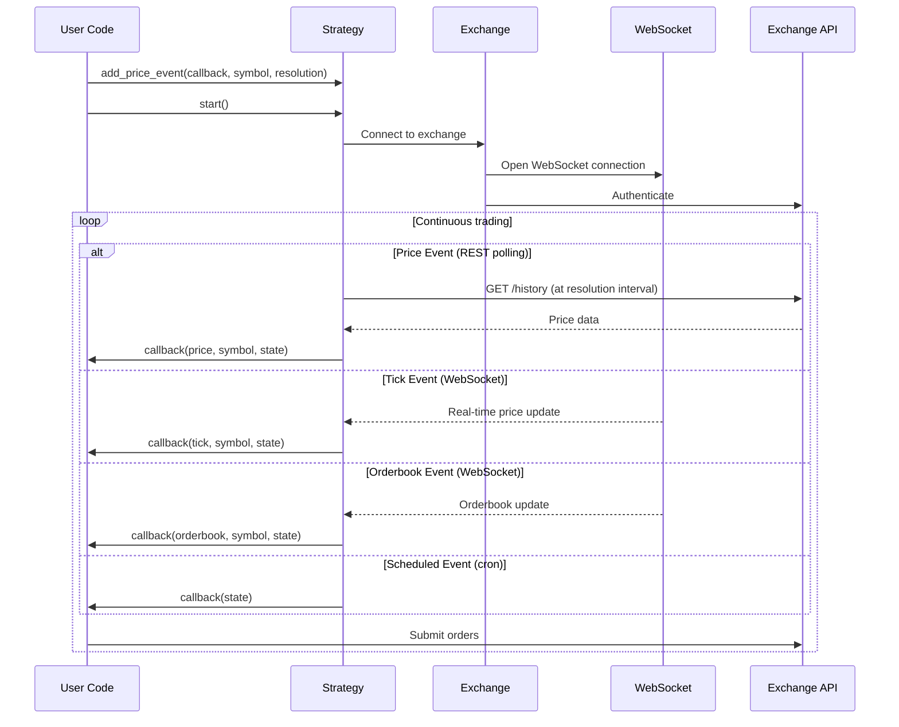
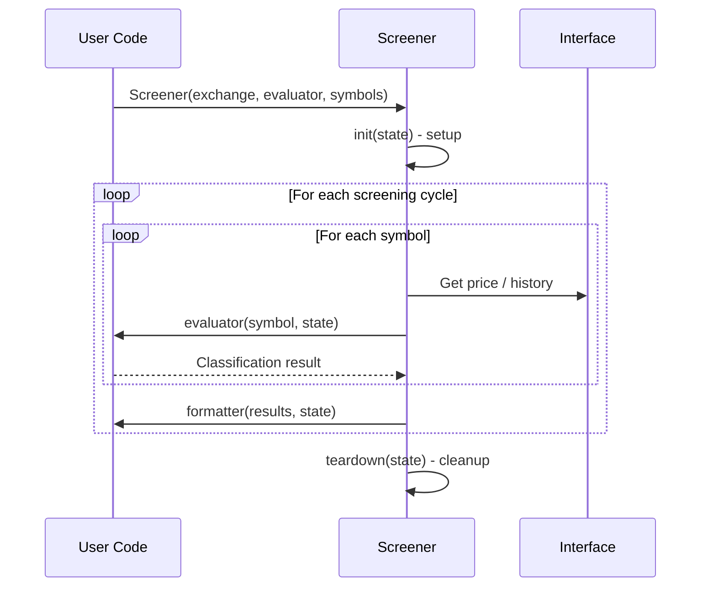
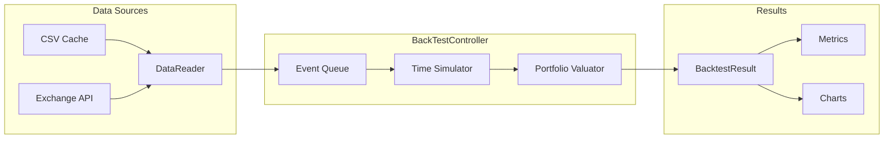
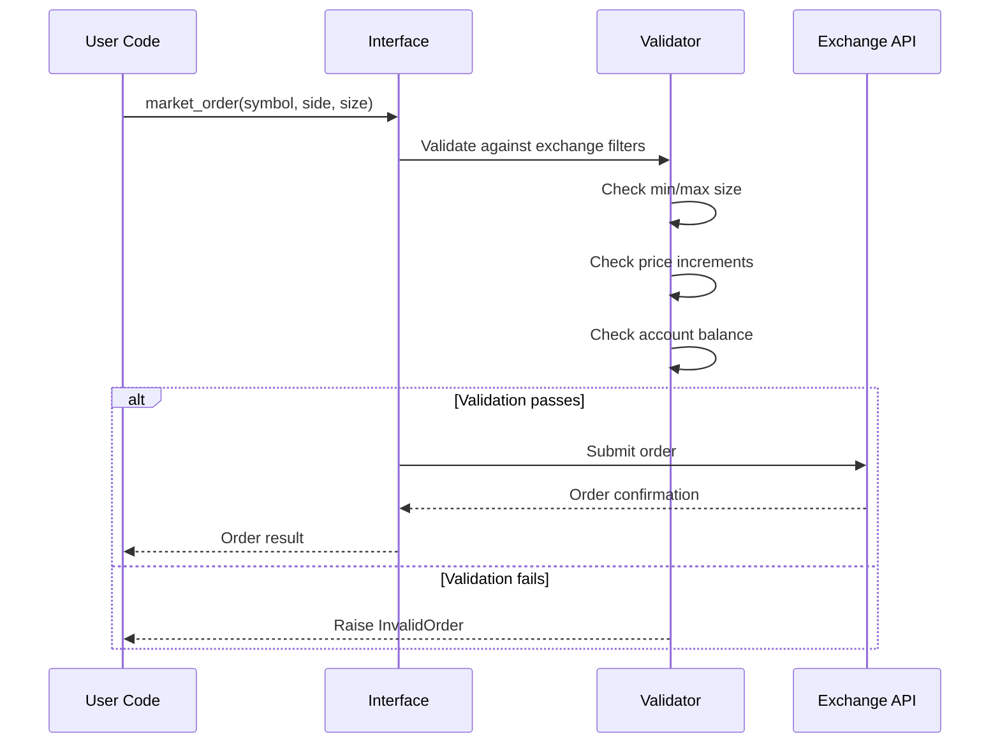

# Blankly -- Workflow

## Strategy Execution Flow

## Live Trading Flow

## Strategy Event Types

| Event Type | Data Source | Trigger | Use Case |
|-----------|------------|---------|----------|
| `price_event` | REST API | Periodic polling | Simple strategies, daily/hourly |
| `bar_event` | REST API | OHLCV bar close | Candlestick-based strategies |
| `tick_event` | WebSocket | Real-time price | Scalping, HFT |
| `orderbook_event` | WebSocket | Orderbook change | Market making |
| `scheduled_event` | Timer | Cron schedule | Portfolio rebalancing |
| `arbitrage_event` | REST/WS | Multi-symbol | Cross-pair arbitrage |

## Screener Workflow

## Backtest Data Flow

## Order Execution Flow

---
## See Also
- [README](README.md) — Project overview and quick start
- [Architecture](architecture.md) — System design and components
- [State Management](state-management.md) — State lifecycle and data models
- [Development](development.md) — Development guide and best practices
